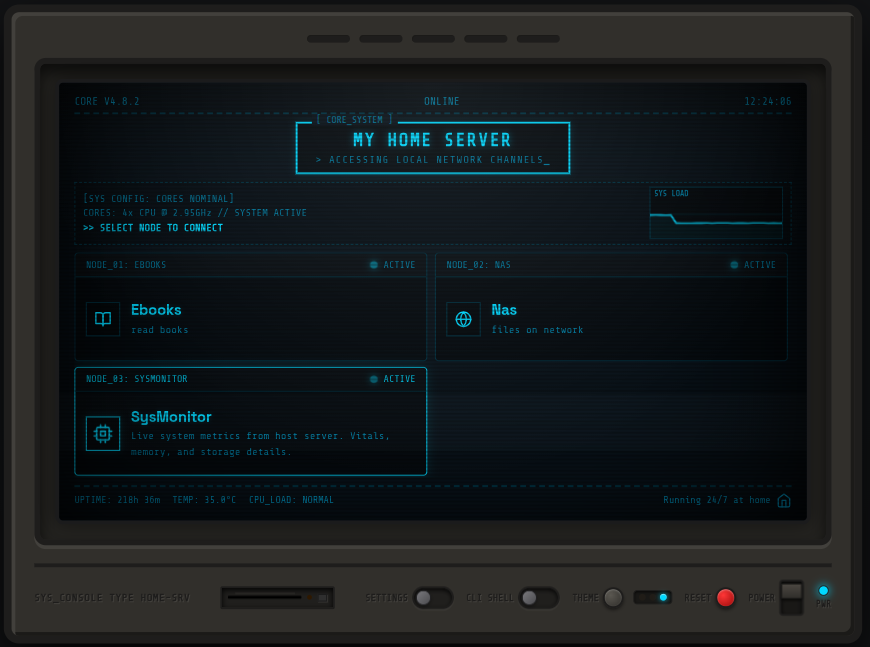
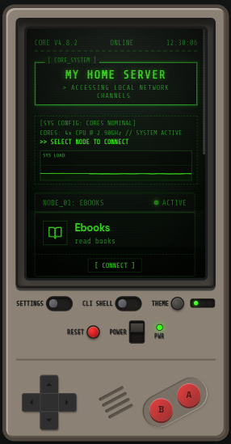
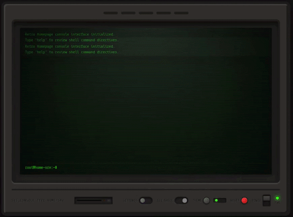

<div align="center">

# Retro Homepage

**A retro CRT dashboard for your homelab — service links, system monitor, and a CLI shell, served from a single binary.**

*Runs on Linux. Termux on Android supported.*

[](LICENSE)
[](https://www.rust-lang.org/)
[](https://github.com/abderazak-py/retro-homepage/releases)

</div>

---

| Desktop | Mobile |
|:---:|:---:|
|  |  |

---

## What it does

Retro Homepage gives you a single page to reach everything on your homelab — your NAS, media server, dashboards, whatever you run — wrapped in a CRT monitor aesthetic that actually looks good.

On top of that it has a built-in **system monitor** that shows live CPU load (physical cores & threads), RAM, temperature (via thermal zones), storage, battery (on laptops and Android), and uptime. All of it served from one binary with no config files or dependencies at runtime.

Open the CLI shell and you can run commands like `matrix`, `neofetch`, `ping`, and `monitor` directly from the page.

---

## Demo



---

## Features

- **System monitor** — live CPU graph (displaying physical cores & logical threads), RAM, storage, uptime, system temperature, and battery (laptops and Android)
- **Service nodes** — link out to anything running on your network
- **CRT aesthetic** — scanlines, phosphor flicker, roll bar, boot and shutdown animations
- **Built-in CLI shell** — `matrix`, `neofetch`, `ping`, `monitor`, `help`
- **Three themes** — Retro Green, Amber, Cyberpunk Blue — switchable from the bezel
- **Mobile layout** — a Game Boy-style shell for small screens
- **Single binary** — no web server to manage, no files to serve, just run it

---

## Getting started

### On Linux (homelab server)

Download the latest release for your architecture from the [Releases](https://github.com/abderazak-py/retro-homepage/releases/latest) page, or download and run via the terminal:

```bash
# Download and extract the latest release for x86_64
curl -LO https://github.com/abderazak-py/retro-homepage/releases/latest/download/retro-homepage-v1.0.0-linux-x86_64.tar.gz
tar -xzf retro-homepage-v1.0.0-linux-x86_64.tar.gz
cd retro-homepage-v1.0.0-linux-x86_64
./retro-homepage
```

Then open `http://localhost:3000` in your browser.

### On Android (Termux)

```bash
# Download and extract the latest release for ARM64
curl -LO https://github.com/abderazak-py/retro-homepage/releases/latest/download/retro-homepage-v1.0.0-linux-aarch64.tar.gz
tar -xzf retro-homepage-v1.0.0-linux-aarch64.tar.gz
cd retro-homepage-v1.0.0-linux-aarch64
pkg install termux-api   # for battery stats
./retro-homepage
```

Open `http://<YOUR_PHONE_IP>:3000` from any device on your network.

---

## Adding and managing your services

No compiling needed — everything is managed through the UI.

**On first launch**, the setup screen lets you name your server and add your service nodes.

**Later**, open the **Settings** page from the bezel to add more services, edit existing ones, or rename your server. Changes take effect immediately.

---

## Building from source

```bash
# show all commands
python3 script.py help

# minify the frontend
python3 script.py minify

# build and run locally
python3 script.py build
python3 script.py run

# cross-compile for ARM64 (Termux)
python3 script.py cross

# package release binaries into dist/ as .tar.gz archives
python3 script.py package

# do everything (minify, build, and cross-compile)
python3 script.py all
```

**Prerequisites:** Rust/Cargo, Node.js (for minification), Podman or Docker (for ARM64 cross-compilation).

To transfer the ARM64 binary to your phone, serve it from your PC and pull it with `curl`:

```bash
# on your PC
cd target/aarch64-unknown-linux-musl/release/
python3 -m http.server 8080

# on your phone (Termux)
curl -O http://<YOUR_PC_IP>:8080/retro-homepage
chmod +x retro-homepage
./retro-homepage
```

---

## Contributing

Open an issue before sending a PR — especially for new CLI commands, themes, or telemetry sources. Happy to review.

---

## License

MIT.

---

<details>
<summary>Technical details</summary>

- **Backend:** Rust (Axum + Tokio), reads telemetry from `/proc/stat`, `/proc/cpuinfo` (to detect physical cores & threads), `/proc/meminfo`, `/sys/class/thermal/` (for CPU temperature), and `/sys/class/power_supply/` (for battery on laptops); falls back to `termux-battery-status` on Android
- **Frontend:** Single HTML file, embedded in the binary at compile time via `include_str!`
- **Build pipeline:** `script.py` orchestrates minification (`html-minifier-terser`) and cross-compilation via a Podman/Docker container targeting `aarch64-unknown-linux-musl`
- **API:** `GET /api/stats` returns a JSON object with CPU (cores, threads, usage, frequency, architecture), RAM, battery (charge, status, health, temperature), storage, and uptime; `GET /` serves the frontend
- **Project structure:**
  ```
  retro-homepage/
  ├── src/main.rs         # Rust backend
  ├── index-dev.html      # Frontend source
  ├── index.html          # Minified bundle (embedded in binary)
  ├── script.py           # Build helper
  └── screenshots/        # Demo images and GIF
  ```

</details>
